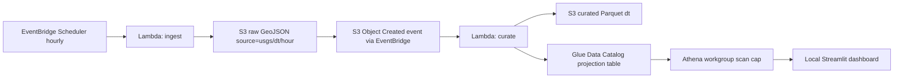

# AWS Serverless Data Pipeline

Near-zero-cost AWS data engineering portfolio project using S3, Lambda, EventBridge, Glue Data Catalog, Athena, Terraform, and a local Streamlit dashboard.

This is the cloud/serverless complement to the local Kafka/PySpark/Iceberg lakehouse project.

## Cost Guardrails

Design target: `$0-$2/month` at portfolio-demo volume. Hard learning budget: stay below `$20-$30` of AWS credits.

The design deliberately avoids the expensive traps:

- No Glue Crawlers: Glue table uses Athena partition projection.
- No Glue ETL jobs: transforms run in Lambda with AWS SDK for pandas.
- No QuickSight: dashboard runs locally in Streamlit.
- No unbounded Athena scans: curated data is Parquet, partitioned by `dt`, and Athena has a 100 MB query scan cap.

Additional guardrails:

- AWS Budget alerts at `$1`, `$5`, and `$10`
- S3 lifecycle expires `raw/` after 14 days
- S3 lifecycle expires `athena-results/` after 7 days
- `terraform destroy` is the one-command cost killer

> Important: do not add Glue Crawlers, Glue ETL jobs, QuickSight, or uncapped Athena workgroups to this repo. Those are intentionally excluded to keep the project near-free.

## Architecture



## Data Source

USGS earthquake event API, no API key required:

```text
https://earthquake.usgs.gov/fdsnws/event/1/query?format=geojson&starttime=<ISO>&endtime=<ISO>
```

The ingest Lambda pulls `[now-65min, now]` to avoid gaps. Curate deduplicates by `event_id` and keeps the row with the latest `updated_time`.

## S3 Layout

```text
raw/source=usgs/dt=YYYY-MM-DD/hour=HH/quakes_<epochms>.geojson
curated/earthquakes/dt=YYYY-MM-DD/part-*.parquet
athena-results/
```

## Curated Columns

```text
event_id, event_time, updated_time, mag, magtype, place,
longitude, latitude, depth_km, type, tsunami, sig, alert,
status, url, net, dt
```

## Repository Layout

```text
infra/       Terraform for S3, IAM, Lambda, EventBridge Scheduler, Glue, Athena, Budgets
src/         Lambda source code
queries/     Athena SQL queries, also registered as Athena named queries
dashboard/   Local Streamlit dashboard over Athena
tests/       Unit tests for ingest and curate logic
scripts/     PowerShell helpers for deploy, teardown, local invoke, and sample backfill
```

## Prerequisites

- AWS CLI configured with an IAM user or role that can create the resources in `infra/`
- Terraform installed and available on `PATH`
- Python 3.11+
- An email address for AWS Budget alerts

Install Terraform on Windows if needed:

```powershell
winget install Hashicorp.Terraform
```

Install local dev dependencies:

```powershell
python -m pip install -r requirements-dev.txt
```

## Deploy Phases

Phase 0 creates only the AWS budget guardrail:

```powershell
cd infra
Copy-Item terraform.tfvars.example terraform.tfvars
# Edit terraform.tfvars and set budget_email.
terraform init
terraform apply -target=aws_budgets_budget.project_cost
```

Then deploy the full stack:

```powershell
terraform apply
```

Destroy when not demoing:

```powershell
terraform destroy
```

The AWS SDK for pandas Lambda layer is configured in `infra/variables.tf`. For `us-east-1` and Python 3.11, this repo defaults to:

```text
arn:aws:lambda:us-east-1:336392948345:layer:AWSSDKPandas-Python311:31
```

Source: [AWS SDK for pandas managed layer documentation](https://aws-sdk-pandas.readthedocs.io/en/stable/layers.html).

## Validate

Invoke ingest manually:

```powershell
aws lambda invoke --function-name aws-serverless-data-pipeline-ingest response.json
```

Run Athena queries from `queries/` after data arrives.

Confirm the output paths:

```powershell
aws s3 ls s3://<bucket-name>/raw/source=usgs/ --recursive
aws s3 ls s3://<bucket-name>/curated/earthquakes/ --recursive
```

Expected Athena behavior:

- Queries return rows after data arrives.
- Data scanned stays under the 100 MB workgroup cap.
- Queries filter on `dt` so Athena can use partition projection.

Start the local dashboard:

```powershell
cd dashboard
pip install -r requirements.txt
streamlit run app.py
```

## Services

- S3 for raw, curated, and Athena results
- EventBridge Scheduler for hourly ingestion
- EventBridge rule for S3 raw object-created events
- Lambda ingest, dependency-free Python stdlib
- Lambda curate, Python 3.11 plus AWS SDK for pandas managed layer
- Glue Data Catalog table with partition projection
- Athena workgroup with enforced scan cap
- Streamlit local dashboard over Athena

## Known Limitations

- This is a portfolio-scale pipeline, not production throughput engineering.
- Curate deduplicates within touched partitions, which is appropriate for the overlapping hourly USGS window.
- Local Streamlit dashboard needs AWS credentials configured on the machine running it.
- On Windows, very new `moto` releases can hit long-path install issues. This repo pins a Windows-friendlier version for local tests.

## Local Quality Checks

```powershell
python -m ruff check .
python -m pytest -q
cd infra
terraform fmt -recursive -check
terraform init -backend=false
terraform validate
```

No AWS resources are created by the Python tests or Terraform validation commands.
