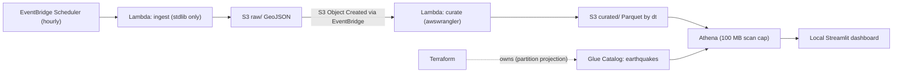

# AWS Serverless Data Pipeline

[](https://github.com/RaveendraS33/aws-serverless-data-pipeline/actions/workflows/ci.yml)

An end-to-end **serverless data engineering pipeline on AWS**, provisioned entirely with **Terraform** and designed to run at **near-zero cost** (target `$0-$2/month`). It ingests live USGS earthquake data on an hourly schedule, lands it in an S3 data lake, curates it to partitioned Parquet, catalogs it with Glue + Athena **partition projection** (no crawlers), and serves analytics through a local Streamlit dashboard.

This is the cloud/serverless complement to a local Kafka -> PySpark -> Iceberg lakehouse project: the same data-engineering fundamentals (event-time partitioning, idempotent dedup, schema-on-read) expressed with managed AWS services.

> **Status:** deployed and verified end-to-end on AWS. A representative Athena query returns rows while scanning only a few hundred bytes, thanks to partition projection plus columnar Parquet.

## Highlights

- **100% Infrastructure as Code** (Terraform): one command to build, one command (`terraform destroy`) to tear down to `$0`.
- **Cost-engineered**: deliberately avoids the four expensive traps in this service set (Glue crawlers, Glue ETL jobs, QuickSight, uncapped Athena) — see [Cost Guardrails](#cost-guardrails).
- **Event-driven**: EventBridge Scheduler triggers ingest hourly; new raw objects flow `S3 -> EventBridge -> curate Lambda`.
- **Least-privilege IAM**: each Lambda runs under its own scoped role; the deployer's broad rights are separate from the runtime roles.
- **Partition projection**: Athena resolves partitions from the S3 path template — no crawler, no `MSCK REPAIR`, no catalog drift. Terraform owns the Glue table; the curate Lambda only writes Parquet files.
- **Idempotent curation**: dedup by `event_id`, keeping the latest revision (`updated_time`).
- **CI**: ruff + pytest + `terraform fmt`/`validate` on every push.

## Architecture



## Data Source

USGS earthquake event API, no API key required:

```text
https://earthquake.usgs.gov/fdsnws/event/1/query?format=geojson&starttime=<ISO>&endtime=<ISO>
```

The ingest Lambda pulls `[now-65min, now]` to avoid gaps. The curate Lambda deduplicates by `event_id` and keeps the row with the latest `updated_time`.

## S3 Layout

```text
raw/source=usgs/dt=YYYY-MM-DD/hour=HH/quakes_<epochms>.geojson
curated/earthquakes/dt=YYYY-MM-DD/*.snappy.parquet
athena-results/
```

## Curated Columns

```text
event_id, event_time, updated_time, mag, magtype, place,
longitude, latitude, depth_km, type, tsunami, sig, alert,
status, url, net, dt
```

## Cost Guardrails

Design target: `$0-$2/month` at portfolio-demo volume. Hard learning budget: stay below `$20-$30` of AWS credits / Free Tier.

The design deliberately avoids the expensive traps:

- **No Glue Crawlers**: the Glue table uses Athena partition projection.
- **No Glue ETL jobs**: transforms run in Lambda with the AWS SDK for pandas.
- **No QuickSight**: the dashboard runs locally in Streamlit.
- **No unbounded Athena scans**: curated data is Parquet, partitioned by `dt`, and the Athena workgroup enforces a 100 MB per-query scan cap.

Additional guardrails:

- AWS Budget alerts at `$1`, `$5`, and `$10` (credits/refunds excluded, so they track real usage).
- S3 lifecycle expires `raw/` after 14 days and `athena-results/` after 7 days.
- `terraform destroy` is the one-command cost killer.

Every service used here (S3, Lambda, Glue Data Catalog, Athena, EventBridge, CloudWatch, Budgets) is covered by AWS Free Tier / credits at this volume, so there is no path to surprise card charges.

> Important: do not add Glue Crawlers, Glue ETL jobs, QuickSight, or uncapped Athena workgroups to this repo. They are intentionally excluded to keep the project near-free.

## AWS Account Setup

You bring your own AWS account and credentials. **No credentials are stored in this repo** — you configure them locally (see the [Credentials & Secrets Policy](#credentials--secrets-policy)).

1. **Create an AWS account** at <https://aws.amazon.com>. The Free Tier (and any account credits) covers nearly all of this workload — see [Cost Guardrails](#cost-guardrails).
2. **Secure the root user**: enable MFA on the root account and then stop using root for day-to-day work.
3. **Create an IAM user for deployment** (IAM -> Users -> Create user, e.g. `pipeline-deployer`):
   - For a personal learning account, attaching `AdministratorAccess` is the simplest way to let Terraform create every resource. Only this human/CI *deployer* needs broad rights — the pipeline's own Lambdas run under separate least-privilege roles defined in [`infra/iam.tf`](infra/iam.tf).
   - For a shared/production account, scope the deployer down to the services in use: S3, Lambda, IAM (role/policy management), Glue, Athena, EventBridge (Scheduler + Events), Budgets, and CloudWatch Logs.
   - Create an **access key** (use case: CLI) and copy the Access Key ID and Secret Access Key.
4. **Configure credentials locally** (stored in `~/.aws/credentials`, outside this repo):

   ```powershell
   aws configure
   # AWS Access Key ID:     <your-access-key-id>
   # AWS Secret Access Key: <your-secret-access-key>
   # Default region name:   us-east-1
   # Default output format: json
   ```

   Verify:

   ```powershell
   aws sts get-caller-identity
   ```

5. **Set your project variables** (kept out of git):

   ```powershell
   cd infra
   Copy-Item terraform.tfvars.example terraform.tfvars
   # Edit terraform.tfvars and set budget_email = "you@example.com"
   ```

   `budget_email` is required: if it is left empty the budget guardrail is skipped (its `count` is 0), so set a real address before deploying.

### Credentials & Secrets Policy

- **No credentials live in this repo.** The deployer supplies their own via `aws configure`; they are read from `~/.aws/` at deploy time.
- `*.tfvars`, `*.tfstate*`, `.terraform/`, and Lambda `*.zip` bundles are **gitignored** — they hold your email, account IDs, and infrastructure detail and must never be committed.
- The only AWS account ID shown anywhere in this repo is `336392948345`, which is **AWS's public managed-layer account** for the AWS SDK for pandas layer — not yours.

## Prerequisites

- An AWS account and a configured IAM user/role (see [AWS Account Setup](#aws-account-setup)).
- **AWS CLI v2** installed and configured.
- **Terraform** on `PATH` (CI pins `1.10.3`; any `>= 1.6` works). On Windows:

  ```powershell
  winget install Hashicorp.Terraform
  ```

- **Python 3.11+** for local tests and the dashboard.
- An email address for AWS Budget alerts.

Install local dev dependencies:

```powershell
python -m pip install -r requirements-dev.txt
```

## Deploy

**Phase 0 — create the budget guardrail first** (so a cost alarm exists before anything else can spend):

```powershell
cd infra
terraform init
terraform apply -target=aws_budgets_budget.project_cost
```

**Phase 1 — deploy the full stack:**

```powershell
terraform apply
```

This provisions S3 (encryption, public-access block, lifecycle), the two Lambdas and their IAM roles, the EventBridge Scheduler + rule, the Glue database/table with partition projection, the Athena workgroup with the scan cap, and the three named queries.

The AWS SDK for pandas Lambda layer is configured in [`infra/variables.tf`](infra/variables.tf). For `us-east-1` and Python 3.11 the repo defaults to:

```text
arn:aws:lambda:us-east-1:336392948345:layer:AWSSDKPandas-Python311:31
```

Source: [AWS SDK for pandas managed layer documentation](https://aws-sdk-pandas.readthedocs.io/en/stable/layers.html). If you deploy to another region, update the ARN's region and confirm the layer version exists there.

**Tear down to `$0`** when not demoing:

```powershell
terraform destroy
```

PowerShell helpers in [`scripts/`](scripts/) wrap these (`deploy.ps1`, `teardown.ps1`, `invoke_local.ps1`).

## Validate

First, capture the deployed resource names from Terraform outputs:

```powershell
cd infra
terraform output
# bucket_name, glue_database, glue_table, athena_workgroup, region
```

If you left `bucket_name` empty, it is auto-derived as `<project_name>-<account_id>-<region>` (e.g. `aws-serverless-data-pipeline-123456789012-us-east-1`). Substitute that value for `<your-bucket-name>` in the commands below.

Invoke ingest manually (it normally runs hourly):

```powershell
aws lambda invoke --function-name aws-serverless-data-pipeline-ingest response.json
Get-Content response.json
```

Confirm objects land in S3:

```powershell
aws s3 ls s3://<your-bucket-name>/raw/source=usgs/ --recursive
aws s3 ls s3://<your-bucket-name>/curated/earthquakes/ --recursive
```

Run an Athena query through the capped workgroup (queries in [`queries/`](queries/) are also registered as Athena named queries):

```powershell
aws athena start-query-execution `
  --work-group aws-serverless-data-pipeline-workgroup `
  --query-execution-context Database=aws_serverless_data_pipeline `
  --query-string "SELECT dt, count(*) AS events, round(max(mag),2) AS max_mag FROM earthquakes WHERE dt >= date_format(current_date - interval '7' day, '%Y-%m-%d') GROUP BY dt ORDER BY dt"
```

Expected Athena behavior:

- Queries return rows once data has arrived.
- Data scanned stays well under the 100 MB workgroup cap (filtering on `dt` lets Athena use partition projection).

Start the local dashboard (uses your local AWS credentials to read Athena):

```powershell
cd dashboard
pip install -r requirements.txt
streamlit run app.py
```

## Repository Layout

```text
infra/       Terraform for S3, IAM, Lambda, EventBridge Scheduler, Glue, Athena, Budgets
src/         Lambda source code (ingest, curate, shared helpers)
queries/     Athena SQL, also registered as Athena named queries
dashboard/   Local Streamlit dashboard over Athena
tests/       Unit tests for ingest and curate logic
scripts/     PowerShell deploy/teardown/local-invoke helpers (*.ps1) + a Python sample-GeoJSON generator (seed_backfill.py)
```

## CI and Local Quality Checks

CI (GitHub Actions) runs on every push and pull request to `main`: ruff lint, pytest, `terraform fmt -check`, and `terraform validate`. Run the same checks locally:

```powershell
python -m ruff check .
python -m pytest -q
cd infra
terraform fmt -recursive -check
terraform init -backend=false
terraform validate
```

No AWS resources are created by the Python tests or by Terraform validation.

## Known Limitations

- This is a portfolio-scale pipeline, not production throughput engineering.
- Curate deduplicates within touched partitions, which is appropriate for the overlapping hourly USGS window.
- The local Streamlit dashboard needs AWS credentials configured on the machine running it.
- On Windows, very new `moto` releases can hit long-path install issues, so this repo pins a Windows-friendlier version for local tests.
